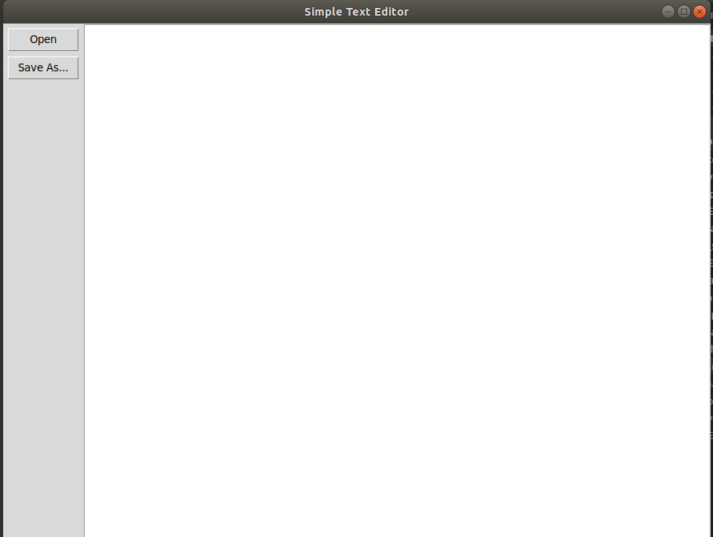
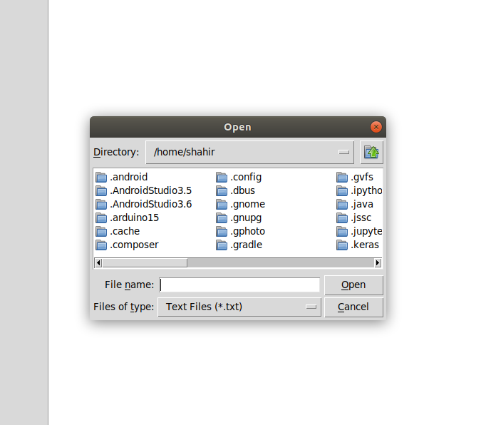
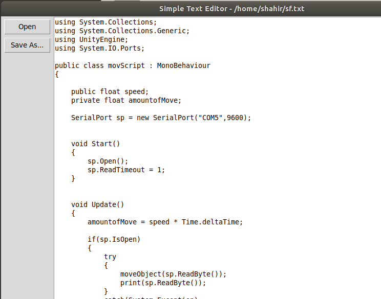
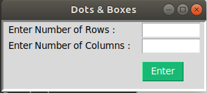
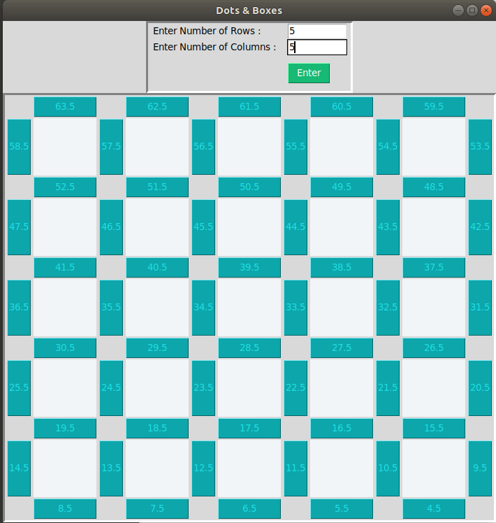
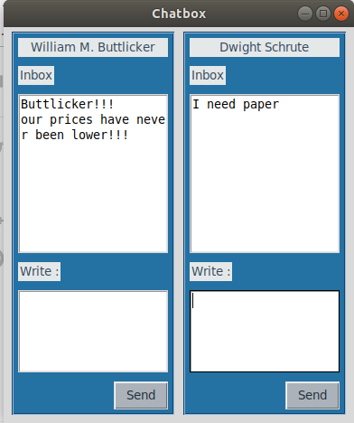

# Python_tkinter tutorials
 1. A beginners guide.
 2. pygui_1.py has all the contents I learned from realpython.com.
 3. Visit : https://realpython.com/python-gui-tkinter/
 4. 
 5. 
 6. 
# dot_box.py
1. A game between computer AI and human. where the gui was made based on the knowledge from the python tkinter from realpython.
2. 
3.  
# chat box application
1. A chat application demo I tried to make using pytinker knowledge. The Author made a text editor. So I tried to make something similar but not exactly the same. 
2. 

